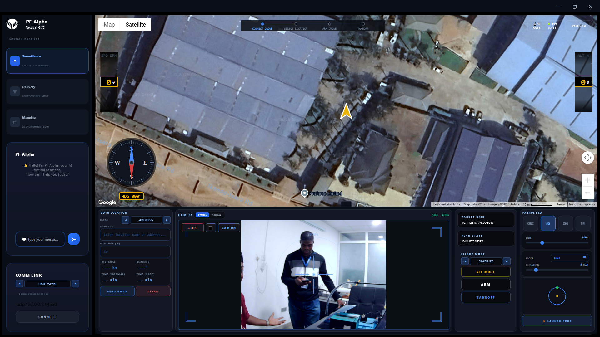

# 🚀 pf-Alpha GCS
### Portable Alpha — Gas Capture System

> *Precision. Portability. Performance.*

---

## 👋 About

Welcome to **Emmanuel Sheshi's** GitHub — home of open-source projects, embedded systems engineering, and field-ready hardware solutions.

**pf-Alpha GCS** is a flagship portable gas capture and detection system designed for real-world field operations. Built for reliability in demanding environments, it combines cutting-edge sensor fusion with rugged hardware design.

---

## 🛠️ Featured Project — pf-Alpha GCS

|  |  |
|:---:|:---:|
| **Gas Detection Unit** | **Field Deployment** |

### Key Features
- 🔬 **Multi-gas sensor array** — detects a wide range of target gases with high accuracy
- 📡 **Wireless telemetry** — real-time data streaming to ground station
- ⚡ **Low-power operation** — optimised for extended field missions
- 🧩 **Modular architecture** — swap sensor heads for different detection profiles
- 🛡️ **Ruggedised enclosure** — IP-rated for outdoor and industrial environments

---

## 🚁 Projects & Work

|  |  |
|:---:|:---:|
| **Flight Systems** | **Hardware Builds** |

---

## 🧰 Tech Stack

---

## 📊 GitHub Stats

---

## 📬 Connect

---

*Built with passion. Deployed in the field.*

